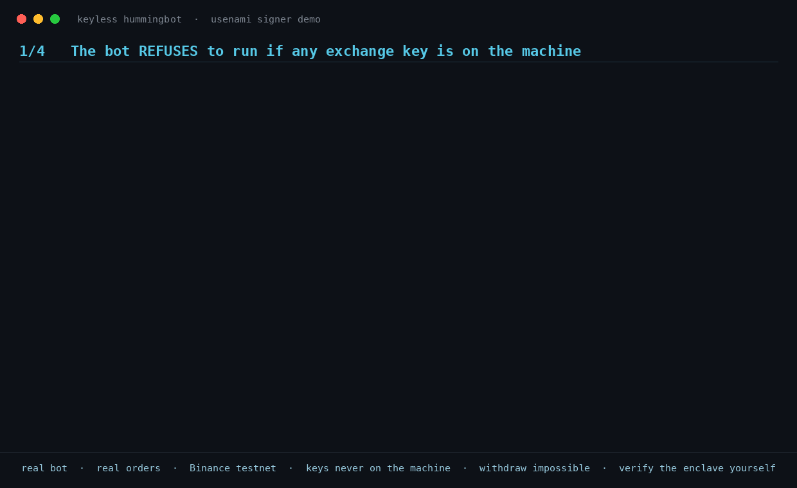

# keyless-hummingbot-demo



**Run Hummingbot with zero exchange keys on your machine.** The bot holds only a
revocable bearer token; every Binance request signature is produced inside an
**AWS Nitro Enclave** ([Usenami Signer](https://usenami.io)) that your exchange
API **secret** never leaves. (Your API *key* — the public `X-MBX-APIKEY`
identifier, not the signing secret — is returned per request for the header and
never stored on the bot.)

> ## ⚠️ TESTNET ONLY · PRE-AUDIT
> This demo signs for **Binance Futures TESTNET** exclusively — play money, no
> withdrawals. Usenami Signer has **not yet been audited by an independent
> security firm**. Do not point this at real funds; we gate real-funds use
> behind audit and redundancy milestones ourselves.
> What we *can* offer today is verifiability: see [VERIFY.md](VERIFY.md).

## What this is

A stock Hummingbot `binance_perpetual` connector where the auth class is swapped
for [`signer_delegating_auth.py`](signer_delegating_auth.py). The only real
override is `rest_authenticate` (~10 lines): the connector builds its request
params exactly as stock, then — instead of the one local-HMAC line — asks the
enclave to sign:

```http
POST https://signer-demo.usenami.io:8443/sign/binance-request
Authorization: Bearer <your token>
{ "key_id": "binance",
  "op": "order",
  "payload": "symbol=BTCUSDT&side=BUY&...&timestamp=1700000000000" }
→ 200 { "signature": "<hex hmac-sha256>", "api_key": "<X-MBX-APIKEY>" }
```

The enclave signs your **exact payload string**, so signatures are byte-identical
to a stock local-HMAC connector. The `api_key` here is the public `X-MBX-APIKEY`
identifier (not the signing secret); it is returned transiently per request and
never sits on your disk.

Because Binance's HMAC covers only the params (never the URL path), the enclave
enforces a **positive per-operation parameter allow-list** on the payload before
signing: trading and read operations pass; any withdraw / transfer / sub-account
parameter is rejected (`403 action_not_allowed`) — including a withdraw payload
smuggled under an allowed operation name.

## Quickstart

1. **Request access** → [usenami.io](https://usenami.io) (or
   [business@usenami.io](mailto:business@usenami.io)). You receive a bearer
   token bound to a Binance Futures **testnet** key that is sealed for the
   enclave — you never see or handle the exchange key itself.
2. **Drop in the patch**: copy `signer_delegating_auth.py` into your Hummingbot
   environment and construct the connector's auth with it (where the stock
   `BinancePerpetualAuth(...)` is built):

   ```python
   from signer_delegating_auth import SignerDelegatingAuth
   auth = SignerDelegatingAuth(
       signer_gw="https://signer-demo.usenami.io:8443",
       bearer=os.environ["SIGNER_TOKEN"],   # never hardcode the token
       time_provider=time_synchronizer,
   )
   ```

3. **Run your strategy** against Binance Futures testnet. No `binance_api_key` /
   `binance_api_secret` anywhere in your config — leave them empty.

Sanity check without Hummingbot (any HTTP client works). Pass the token via a
`curl -K -` config on stdin so it never lands in the process argument list
(visible to other users via `ps`):

```bash
printf 'header = "Authorization: Bearer %s"\n' "$SIGNER_TOKEN" | \
  curl -s -K - -X POST https://signer-demo.usenami.io:8443/sign/binance-request \
    -H 'Content-Type: application/json' \
    -d '{"key_id":"binance","op":"account","payload":"recvWindow=5000&timestamp='$(date +%s)000'"}'
# → {"signature":"...","api_key":"..."}   your bot is keyless
```

## What you get — and what you don't (read this)

| Property | Status |
| --- | --- |
| Exchange key on the bot machine | **Never** — sealed for the enclave at provisioning |
| Withdraw / transfer via the token | **Denied in the enclave** (param allow-list, smuggle-tested) |
| Token revocation | Immediate — server-side removal, key stays sealed |
| Per-asset order-size caps on this endpoint | **NOT enforced** (see below) |
| Independent audit | **Not yet** — planned; testnet-gated meanwhile |

**Honest limit:** this generic signing endpoint checks *which parameters* an
operation may carry, but it does **not** parse order semantics — so per-asset
order-size caps are **not** applied here (they exist on Signer's structured
order path, and a caps hook for this path is a prerequisite we hold ourselves
to before any real-funds use). A testnet token cannot lose real money, but do
not describe this demo as "cap-bound".

Details: [THREAT-MODEL.md](THREAT-MODEL.md) — what the enclave defends against
and what it does not.

## Don't trust us — verify

The enclave serves a live, NSM-signed attestation document. You can check with
your own tools — trusting AWS and mathematics, not Usenami — that the running
image is exactly the one whose fingerprint (PCR0) we publish:

```bash
curl -s "https://signer-demo.usenami.io:8443/attestation?nonce=$(openssl rand -hex 16)"
```

Full walkthrough (COSE signature → certificate path to the pinned AWS Nitro
root → PCR0 → nonce): [VERIFY.md](VERIFY.md).

## Contact

Access, questions, vulnerability reports: [business@usenami.io](mailto:business@usenami.io).
